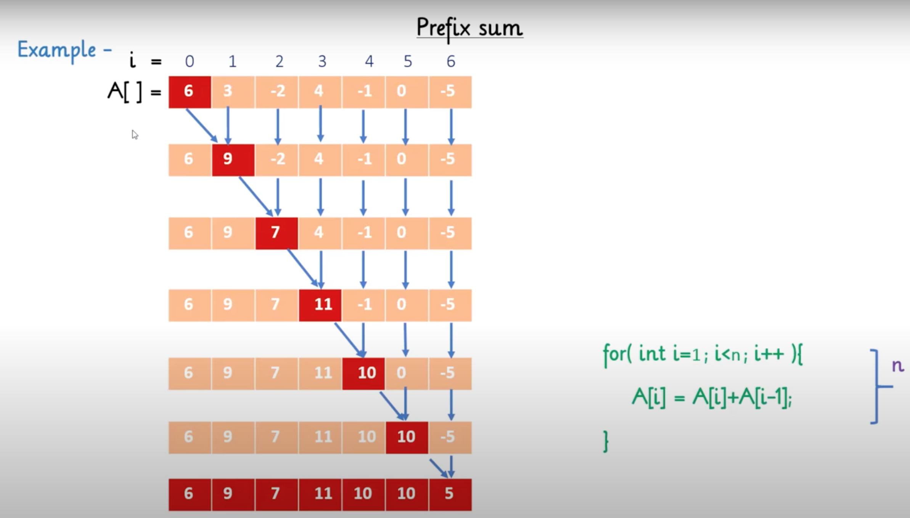
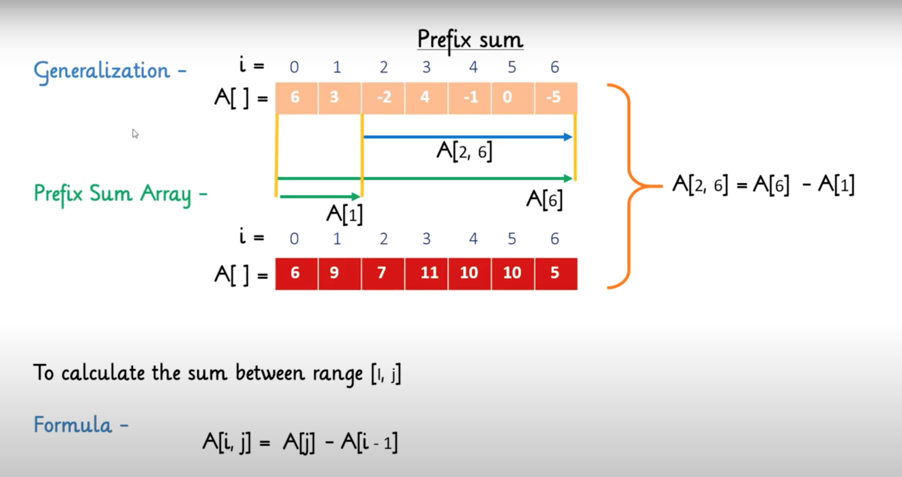
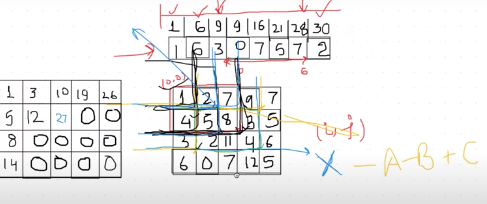
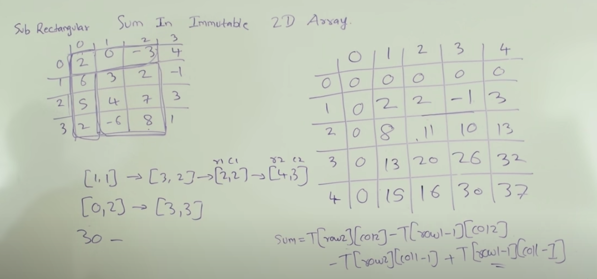

# Prefix sum in 1D Array
https://www.youtube.com/watch?v=pVS3yhlzrlQ

Prefix sum

Range query

```
const prefixSum = (nums, k) => {
    let count = 0 ;
    const n = nums.length;
    const prefixSum = new Array(n+1).fill(0);
    prefixSum[0] = 0;
    for (let i=1; i <= n; i++) {
        prefixSum[i] = prefixSum[i-1] + nums[i-1];
    }
    const rangeSumWrapper = (i, j) => prefixSum[j] - prefixSum[i-1];
    const rangeSum = (i, j) => rangeSumWrapper(i+1, j+1);
    // Iterate all sub array to find match
    for (let i=0; i < n; i ++) {
        for (let j=i; j < n; j++) {
            const sum  = rangeSum(i,j);
            if(sum === k) {
                count++;
            }
        }
    }
    return count;
}
```
# Prefix sum optimization in 1D Array
One of the best solutions for the 1D problem is to use a hashmap with key as prefix sum and value as number of subarrays starting from index zero and having this particular sum value.
```
const optimized  = (nums, k) => {
    const map = new Map();
    let count = 0;
    let sum = 0;
    const n = nums.length;
    map.set(0, 1); // initialize for 0
    for (let i=0; i < n; i++) {
        sum += nums[i];
        if(map.has(sum - k)) {
            count += map.get(sum - k);
        }
        map.set(sum, map.has(sum) ? map.get(sum) + 1: 1)
    }
    return count;
}
```
## Problems
https://leetcode.com/problems/range-sum-query-immutable/

https://leetcode.com/problems/minimum-value-to-get-positive-step-by-step-sum/

https://leetcode.com/problems/subarray-sum-equals-k/

https://leetcode.com/problems/maximum-size-subarray-sum-equals-k/

https://leetcode.com/problems/make-sum-divisible-by-p/

https://leetcode.com/problems/subarray-sums-divisible-by-k/

# Prefix sum in 2D Array
https://www.youtube.com/watch?v=Xu0PfCKy8a8

Prefix sum

Range query
https://www.youtube.com/watch?v=PwDqpOMwg6U



## Problems
https://leetcode.com/problems/range-sum-query-2d-immutable/

https://leetcode.com/problems/number-of-submatrices-that-sum-to-target/

https://leetcode.com/problems/max-sum-of-rectangle-no-larger-than-k/

# Problem seems similar to Prefix Sum but need other algorithm to optimized it
https://leetcode.com/problems/range-sum-query-mutable/

https://leetcode.com/problems/range-sum-query-2d-mutable/


